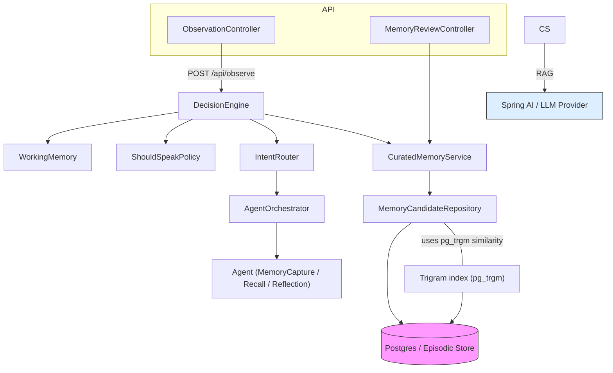

# Architecture

This document gives a high-level overview of the Cognitive AI project's runtime components, data flow, and integratable adapters. It's intentionally short — a starting point for documentation and contribution.

## Overview
- Purpose: ambient cognitive companion that senses observations, filters candidate memory, and decides whether to speak.
- Main components: HTTP API, Cognition loop, Curated memory pipeline, Episodic store, and optional model provider integrations (Spring AI / LLMs).

## Component diagram (Mermaid)

## Data flow (brief)
1. Observation arrives via `POST /api/observe` handled by `ObservationController`.
2. `CognitionService` ingests the observation into `WorkingMemory`, applies `ShouldSpeakPolicy`, and may produce a `MemoryCandidate`.
3. `CuratedMemoryService` summarizes candidates, enqueues them for review, and persists accepted items to the episodic store.
4. For semantic tasks (RAG, summarization), the service delegates calls to the configured model provider via Spring AI.

## APIs (quick)
- `POST /api/observe` — submit an observation
- `GET /api/memory/candidates` — list pending candidates
- `POST /api/memory/candidates/{id}/accept` — accept a candidate

## Deployment notes
- App is packaged as a Spring Boot jar or container. Database: Postgres (Flyway migrations included).
- Keep model keys and provider config out of source (use environment variables or an external secrets system).

## Next docs to add
- Sequence diagram for review flow
- Example request/response payloads
- Ops checklist for running with a cloud provider
