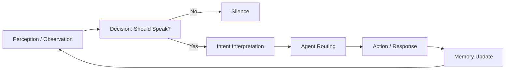

# 🧠 Cognitive AI — In-Depth Explanation

## 1. What is Cognitive AI?

**Cognitive AI** refers to systems designed to **simulate aspects of human thinking**, not just produce outputs.

Unlike traditional AI systems that:

* take input → generate output

Cognitive AI systems:

* **observe**
* **interpret**
* **decide whether to act**
* **choose how to act**
* **remember selectively**
* **explain their behavior**

👉 In short:

> **Cognitive AI is about structuring how a system *thinks*, not just what it outputs.**

---

## 🔄 Cognitive Loop (High-Level)



👉 This loop represents the **core cognition cycle**:
observe → decide → interpret → act → remember

---

## 2. Traditional AI vs Cognitive AI

### Traditional AI (most systems today)

```
Input → Model → Output
```

Examples:

* Chatbots
* Text generators
* Image classifiers

Limitations:

* No self-awareness of actions
* No decision to *not respond*
* No structured memory
* No explainability

---

### Cognitive AI

```
Observation → Decision → Interpretation → Action → Memory → Feedback
```

Key differences:

| Capability                | Traditional AI | Cognitive AI |
| ------------------------- | -------------- | ------------ |
| Decides whether to act    | ❌              | ✅            |
| Has structured memory     | ❌              | ✅            |
| Uses modular reasoning    | ❌              | ✅            |
| Explains behavior         | ❌              | ✅            |
| Handles context over time | ❌              | ✅            |

---

## 3. Core Components of Cognitive AI

A Cognitive AI system is composed of **layers**, not a single model.

---

### 3.1 Perception (Observation)

This is how the system **receives information**.

Examples:

* Text input
* Audio (speech)
* Visual input (images, video)

Output:

```
Observation {
  source,
  content,
  metadata
}
```

👉 This is the system’s **view of the world**

---

### 3.2 Decision Layer (Meta-Cognition)

This is the most important part.

The system asks:

> “Should I respond at all?”

This is often implemented as:

* rules
* policies
* or learned decision models

Example:

* Ignore noise
* Respond only to meaningful input
* Avoid interrupting unnecessarily

👉 This introduces **restraint**, a key cognitive trait

---

### 3.3 Interpretation (Intent Understanding)

The system determines:

> “What does this input *mean*?”

This is handled by:

* rule-based routing
* classifiers
* LLMs (optional)

Output:

```
Intent:
- MEMORY_CAPTURE
- MEMORY_RECALL
- QUESTION
- GENERAL
```

---

### 3.4 Action Layer (Agents)

Instead of one monolithic response generator, Cognitive AI uses:

👉 **Agents**

Each agent:

* handles a specific type of task
* is modular and replaceable

Examples:

* Memory agent
* Reflection agent
* Task agent
* External API agent

---

### 3.5 Memory System

Memory is not just storage.

Cognitive AI distinguishes:

#### Working Memory

* short-term
* recent context

#### Curated Memory

* selectively stored
* reviewed before persistence

#### (Future) Semantic Memory

* embeddings
* similarity-based recall

👉 Key principle:

> **Not everything should be remembered**

---

### 3.6 Explainability

Every action should answer:

* Why did the system respond?
* Why this agent?
* Why this decision?

Example output:

```json
{
  "decision": "SPEAK",
  "intent": "MEMORY_CAPTURE",
  "agent": "MemoryCaptureAgent",
  "reasons": [
    "Explicit remember request present",
    "Intent routed to MEMORY_CAPTURE"
  ]
}
```

👉 This is critical for trust

---

## 4. The Cognitive Loop

The core loop of a Cognitive AI system:

```
1. Observe
2. Decide (should I act?)
3. Interpret (what is this?)
4. Route (who handles it?)
5. Act (agent response)
6. Remember (if meaningful)
```

Or simplified:

```
observe → decide → route → act → remember
```

---

## 5. Multimodal Cognition (Advanced)

Cognitive AI is not limited to text.

It can include multiple **sensory inputs**:

### Text

* direct user input

### Audio

* speech → text (STT)
* tone/emotion (future)

### Vision

* image captioning
* object detection
* scene understanding

---

### Key Design Principle

All inputs must be normalized:

```
Audio → STT → Observation
Vision → Caption → Observation
Text → Observation
```

👉 Then the SAME cognitive loop applies

---

## 6. Why Architecture Matters

In Cognitive AI:

👉 Intelligence is not in one model

It is in:

* how components interact
* how decisions are made
* how memory is managed

---

### Traditional thinking:

> “The model is the intelligence”

### Cognitive AI thinking:

> “The system structure defines intelligence”

---

## 7. Role of LLMs (e.g., Spring AI)

LLMs are:

* **tools**, not the system itself

They can enhance:

* intent understanding
* summarization
* reflection
* memory extraction

But:

> **They should not replace the cognitive architecture**

---

## 8. Types of Cognitive Behavior

A Cognitive AI system can exhibit:

### Selective Attention

* ignores irrelevant inputs

### Restraint

* chooses silence when appropriate

### Context Awareness

* uses recent memory

### Intent Awareness

* distinguishes commands vs questions vs observations

### Explainability

* justifies its actions

---

## 9. Levels of Cognitive AI

### Level 1 — Reactive

* rule-based
* basic decision logic

### Level 2 — Contextual

* memory-aware
* better routing

### Level 3 — Semantic

* embeddings
* similarity-based reasoning

### Level 4 — Adaptive

* learns patterns over time

### Level 5 — Autonomous (future)

* self-directed behavior
* goal-oriented cognition

---

## 10. Why Cognitive AI Matters

Traditional AI systems:

* generate outputs
* lack structure
* are hard to trust

Cognitive AI systems:

* behave more predictably
* are explainable
* scale better with complexity
* can integrate multiple modalities

---

## 11. Summary

Cognitive AI is:

* not a model
* not a framework
* not a single algorithm

It is:

> **An architectural approach to building systems that think in structured, explainable, and context-aware ways**

---

## 12. One-Line Definition

> Cognitive AI is a system that decides when and how to act, based on structured perception, memory, and reasoning — not just input-output generation.

---

## 13. Final Insight

Most developers focus on:

* models
* prompts
* APIs

Cognitive AI focuses on:

* **thinking structure**

---

> The future of AI is not just better models —
> it is better systems that know how to use them.
