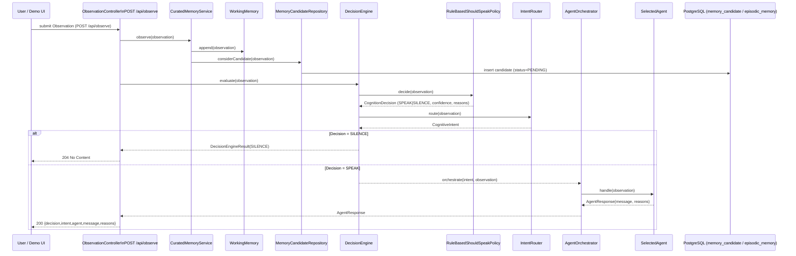

# Cognitive AI Demo Sequence

This document describes the end-to-end flow of the Cognitive AI demo, focusing on the ambient cognition-first loop as experienced via the demo UI or API.

## Sequence Diagram (Mermaid)



## Key Steps

1. **User/Demo UI** submits an observation via the API (`POST /api/observe`).
2. **ObservationController** passes the observation to `CuratedMemoryService` for working memory and candidate review.
3. **CuratedMemoryService** appends to in-process working memory and may create a memory candidate (if explicit remember or recurrence).
4. **MemoryCandidateRepository** persists candidates to the database (`memory_candidate` table).
5. **DecisionEngine** evaluates the observation using `RuleBasedShouldSpeakPolicy` (decides SPEAK/SILENCE) and `IntentRouter` (classifies intent).
6. If the decision is **SILENCE**, the API returns HTTP 204 (no content).
7. If the decision is **SPEAK**, `AgentOrchestrator` selects the appropriate agent (e.g., MemoryCaptureAgent, MemoryRecallAgent, ReflectionAgent) to handle the intent.
8. The selected agent returns a response, which is sent back to the user as a JSON object with decision, intent, agent, message, and reasons.

## Docker Quick Start

To launch the stack (app + Postgres):

```sh
docker-compose up --build
```

- The app will be available at http://localhost:8080
- See `README.md` for API examples and environment setup.

---


## Demo Script: Example Actions & API Calls

### 1. Capture a memory (explicit remember)
**Request:**
POST `/api/observe`
```json
{
  "source": "user",
  "content": "I need to wake up tomorrow early. around 5am",
  "explicitRemember": true
}
```
**Expected:**
Response with `decision: SPEAK`, `agent: MemoryCaptureAgent`, and reasons about memory capture.

---

### 2. Ask a recall question
**Request:**
POST `/api/observe`
```json
{
  "source": "user",
  "content": "What did I ask you to remember?",
  "explicitRemember": false
}
```
**Expected:**
Response with `decision: SPEAK`, `agent: MemoryRecallAgent`, and a recall message (if memory exists).

---

### 3. Make a general statement (should be silent)
**Request:**
POST `/api/observe`
```json
{
  "source": "user",
  "content": "It is sunny today.",
  "explicitRemember": false
}
```
**Expected:**
HTTP 204 No Content (decision: SILENCE).

---

### 4. Review pending memory candidates
**Request:**
GET `/api/memory/candidates`

**Expected:**
List of pending memory candidates (JSON array).

---

### 5. Accept a memory candidate
**Request:**
POST `/api/memory/candidates/{candidate-id}/accept`
```json
{
  "note": "Looks useful for long-term memory"
}
```
**Expected:**
HTTP 204 No Content (candidate accepted and moved to episodic memory).

---

### 6. Reject a memory candidate
**Request:**
POST `/api/memory/candidates/{candidate-id}/reject`
```json
{
  "note": "Not important enough to keep"
}
```
**Expected:**
HTTP 204 No Content (candidate rejected).

---

You can use Postman or curl for all these actions. For more, see the README or ask for custom scenarios.
